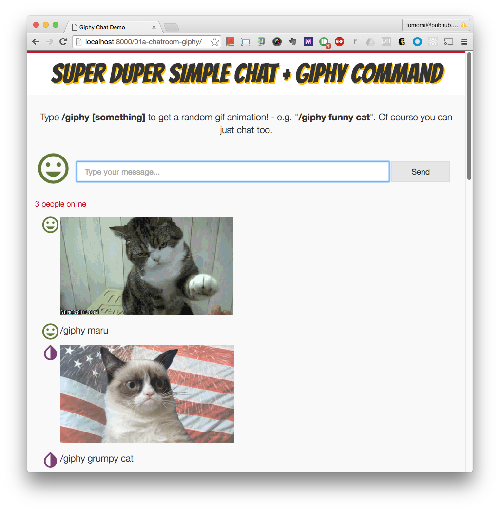

# 1a. Adding Giphy Command Feature to Your Chat App

Now, you are adding the 3rd party API into your app to make it more interesting.

If you are using Slack or similar chat apps, you may have used the "slash commands" before. In this excerse, you're going to implement the Giphy slash command for your chat app.

Let's get started with [Giphy API](https://api.giphy.com/)!

## Giphy REST API

Create a funcition to call the REST API.

It takes a search query as an arg.

```javascript
function getGiphy(q) {
  var url = 'http://api.giphy.com/v1/gifs/translate?api_key=dc6zaTOxFJmzC&s=' + q;

  var xhr = new XMLHttpRequest();
  xhr.open('GET', url);
  xhr.onload = function() {
    var json = JSON.parse(xhr.response);
    var gif = json.data.images.fixed_height.url;    
      // publish it to PubNub
      publishGif(gif);
    };
    xhr.onerror = function(e) {
      console.log(e);
    };
    xhr.send();
}
```

We are using the standard `XMLHttpRequest` for this AJAX call. When it is successful, it result in a JSON response, so you need to parse it to get a gif animation URL.


## Getting a Query from a Chat Message

The query string used to fetch the giphy URL is coming from a chat message.

So what you need to do here is that modify your app by:

1. Once a user publish a message, seek for the string, `/giphy` from the message
2. If true, get the string(s) after the `/giphy` (e.g. "cat")
3. If it contains space (e.g. "funny cat"), concat the strings with `+` ("funny+cat")
4. Pass it to the `getGiphy()` function you just created
5. If there is a gif animation return from Giphy, publish the image url


In your `publish` callback, add this code:

```javascript
pubnub.publish({
  channel: channel,
  message: {
    avatar: avatar.className,
    text: text
  },
  callback: function(m) {
    input.value = '';
        
    if (text.toLowerCase().indexOf('/giphy') > -1) {
      var query = text.replace('/giphy ', '').split(' ').join('+');  
        getGiphy(query);
      }
    }
});
```


## Subscribing the Messages and Images

You also need to modify the DOM to display the image URL corrently at the subscribe success callback.

```javascript
pubnub.subscribe({
  channel: channel,
  callback: function(m) { 
    var content = '<p><i class="' + m.avatar + '"></i><span>';

    if (m.text) {
        content += m.text.replace(/[<>]/ig, '');
    }
    if (m.gif) {
        console.log('giphy added...');
        content += ''
    }
    content += '</span></p>';

    output.innerHTML = content + output.innerHTML;
},
// add presence and history if you want
```


If you wish to call history, you need to work on the UI too. Or just create a new function to take care of the UI, so you don't need ot repeat.

Cool, now you have a slash command enabeld chat room!

